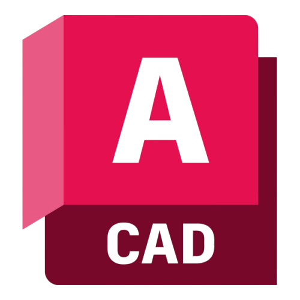
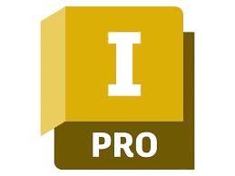
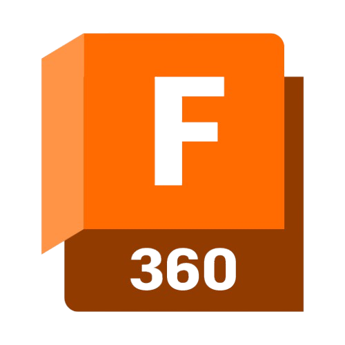
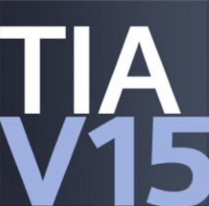
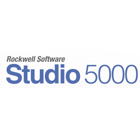
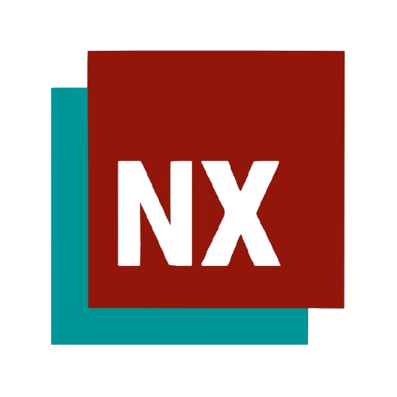
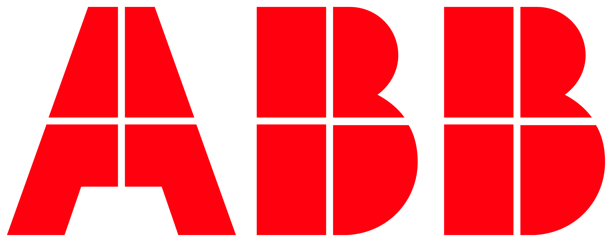
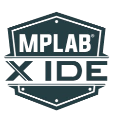

<h1 align="center">Hi , I'm Andrés Felipe Quenan </h1>

  

## 👨‍💻 _About Me_

I'm a Mechatronics Engineering student at the National University of Colombia, with hands-on experience in robotics, industrial automation, and mechanical design. I'm passionate about combining hardware and software to create innovative solutions through control systems, electronics, CAD modeling, and programming in Python.

* 🎓 I'm a Mechatronics Engineering student at the National University of Colombia, passionate about robotics, automation, and intelligent systems.

* 🔧 I enjoy building projects that integrate mechanical design, electronics, and software.

* 🤖 I’ve worked with industrial robots like the ABB IRB 140, PLCs (Allen-Bradley), servo motors, and developed interfaces using Python, ROS 2, and Tkinter.

* 📐 Proficient in CAD tools like Fusion 360 and Inventor, and familiar with control theory.

* 📂 Check out my repositories to see projects involving microcontrollers, digital electronics, automation systems, and robot simulation.

## ⚙️ _My Skills_ 

### Languages

 
  
  
  

### Tools

  
  
  
  
  
  
  
  
  

### IDE
 
  
  
  

<h2>Github stats:</h2> 

